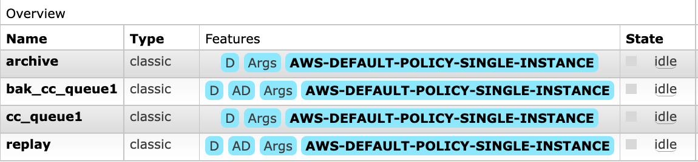
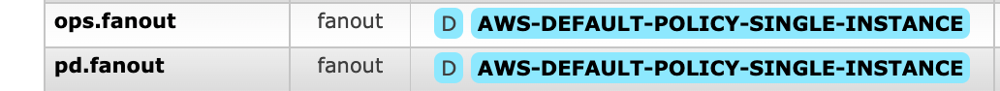
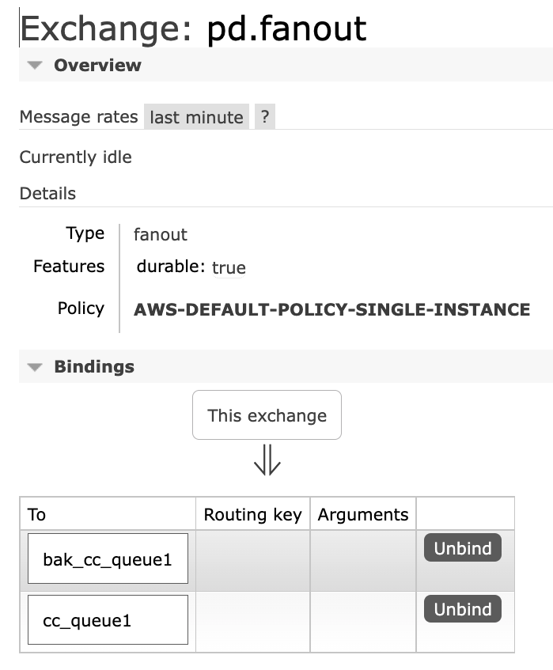
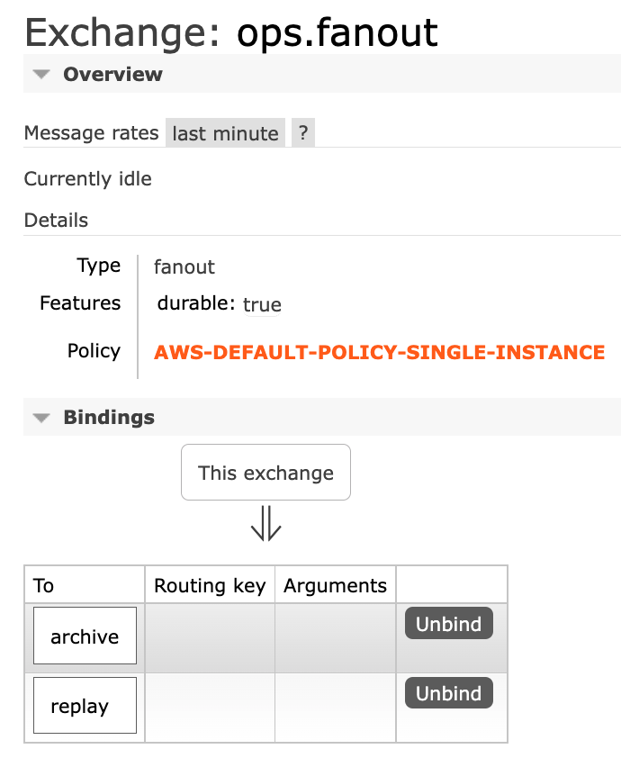
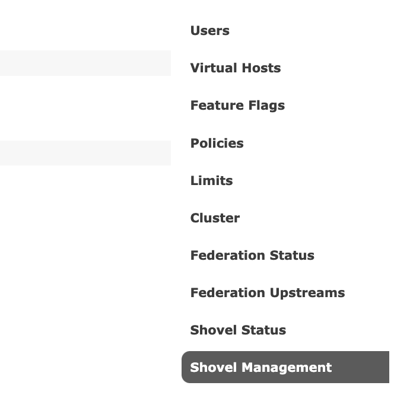
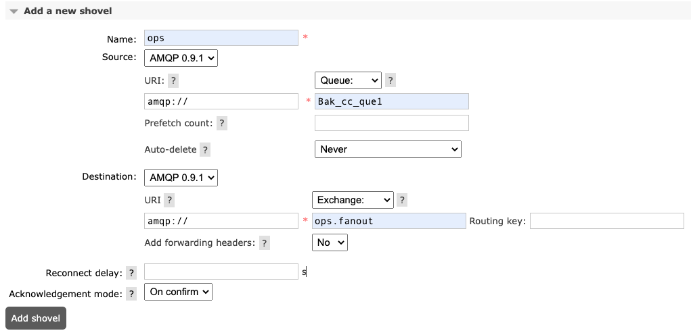
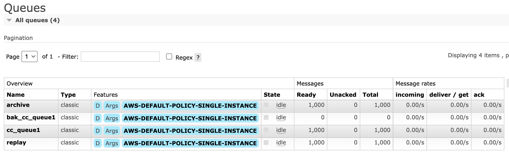
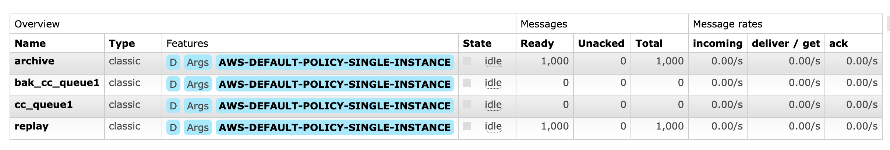

# message-replay-RabbitMQ

## Purpose

For the solutions want to migrate from RocketMQ to RabbitMQ. There is a message relay feature supported in RocketMQ while not in RabbitMQ. This project provide a low code message replay solution for RabbitMQ.

### 
Key features

1. use message_id in the properties for filtering
2. you can set the max number to be fileter, when the max number reached, the lambda function will be finished.

## Solution Design

 
Solution design graph

Use the fan-out exchange to copy(route) the same message to cc_que1 and bak_cc_que1. The fan-out exchange will keep the messages are delivered to both two queues.
Setup the shovel plugin between source queue: bak_cc_que1 and the target:Operation (fan_out exchange). the message will be automatically sync between bak_cc_que1 and Replay(queue)
The message will be deleted from cc_que1 after consumed. If there is something wrong happened in the consuming micro-service. you can replay the message from replay queue. start the message replay lambda , it will consume the message in from the replay queue. The messages which match the filters will be tagged and put to the pd exchange again. The consuming micro-service can process the replay message without any code logic change. 

## Setup Env

### Exchange & Queues setup in RabbitMQ

queues created in this PoC

exchange created in this PoC

the binding for Exchange pd

the binding for Exchange ops

### Shovel config in RabbitMQ

go to “Admin” → “Shovel Management”

Shovel Management panel

add a new shovel

### Lambda setting for message replay

Parameters description for [messagereply.lambda.py](https://github.com/shengbo66/message-replay-RabbitMQ/blob/main/messagereply.lambda.py)

|Key	|Value	|Description	|
|---	|---	|---	|
|BrokerArn	|arn:aws:mq:us-east-1:48xxxxx1127:broker:MsgReplay:b-a6dee68d-c03a-41f7-948d-e1af60cf9e65	|The Arn for the rabbitMQ broker	|
|---	|---	|---	|
|SecretManagerArn	|arn:aws:secretsmanager:us-east-1:48xxxxxx1127:secret:rabbitmq-WYC14r	|the secrets arn which store the credential for rabbitMQ accessing	|
|msgNofiler	|1671029198	|the massgeNo greater than this filter will be replayed	|
|queue_name	|replay	|the target queue name	|
|replayMaxNo	|10	|the maximum number of message replayed	|

This lambda relies on pika , you can upload the [pika.zip](https://github.com/shengbo66/message-replay-RabbitMQ/blob/main/pika.zip) in the layers.

### Testing

You can use the **msgGenerate4rabbitmq_python_lambda.py** to produce the message
it is also a lambda function
the parameters are 

|Key	|Value	|Description	|
|---	|---	|---	|
|BrokerArn	|arn:aws:mq:us-east-1:48xxxxxx1127:broker:MsgReplay:b-a6dee68d-c03a-41f7-948d-e1af60cf9e65	|The Arn for the rabbitMQ broker	|
|---	|---	|---	|
|SecretManagerArn	|arn:aws:secretsmanager:us-east-1:48xxxxxx1127:secret:rabbitmq-WYC14r	|the secrets arn which store the credential for rabbitMQ accessing	|
|msgNo	|1000	|the number of message to be produced	|

produce 1000 msg, message_id start from 1671028898

consume the message in cc_queue1 (production queue)

replay message_id from 1671029198, there should be 700 message within the scope. but we set replayMaxNo : 500;  it means only first 500 messages will be replayed.

